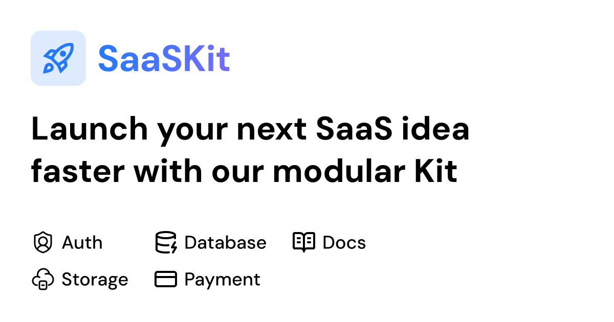

# SaaSKit - Tanstack Start Starter

### The Open Source boilerplate for TanStack Start & Better-Auth.

[](https://tanstack.com/router/latest)
[](https://better-auth.com/)
[](https://tailwindcss.com/)
[](https://www.typescriptlang.org/)

Stop wasting 3-4 hours setting up the basics. **SaaSKit Starter** provides a production-ready foundation with Authentication and Admin Layouts pre-configured, so you can skip the setup and start building your SaaS.

## ✨ Features

- **TanStack Start Integrated:** Server-side rendering (SSR) and static generation ready.
- **Authentication Ready:** Complete **Better-Auth** setup with functional Sign In and Sign Up UIs.
- **Admin Layout:** A responsive, sidebar-navigation layout ready for your dashboard.
- **UI Components:** Styled with Tailwind CSS and **Lucide Icons**.
- **Modular Architecture:** Designed to be easily extended or stripped down.

## 🚀 Quick Setup

Follow these steps to get your project up and running locally.

### 1. Clone and Install

Clone the repository and install the dependencies.

```bash
git clone [https://github.com/paceui/saaskit-starter.git](https://github.com/paceui/saaskit-starter.git)
cd saaskit-starter
npm install
```

### 2. Environment Configuration

**Important:** You need to configure your environment variables before migrating the database. Rename the example file and add your Database URL and Auth Secret.

```bash
cp .env.example .env
```

### 3. Database Migration

Once your `.env` is set up, run the Better-Auth migration to prepare your database.

```bash
npx @better-auth/cli@latest migrate --config=src/features/auth/auth.ts
```

### 4. Run Development Server

```bash
npm run dev
```

The app will be available at [http://localhost:3000](http://localhost:3000).

## 📚 Documentation

For the most up-to-date documentation, guides, and deployment examples, visit our online docs:

👉 **[saaskit.paceui.com](https://saaskit.paceui.com/docs)**
